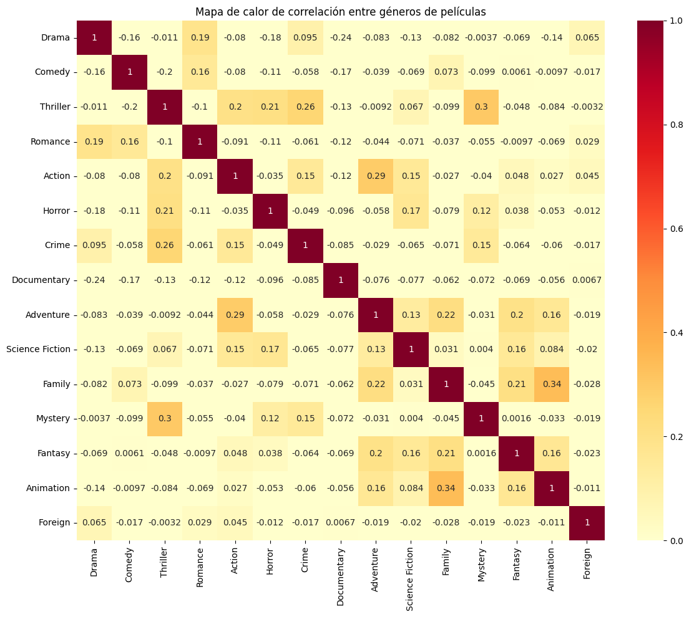
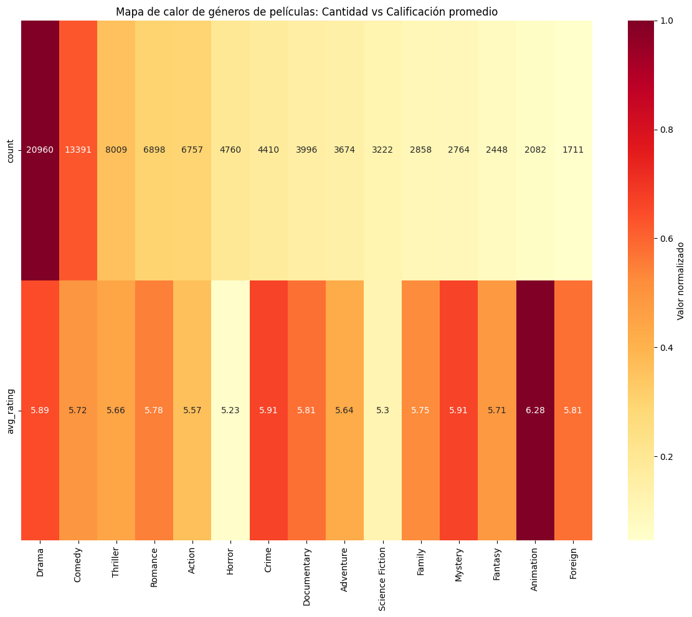
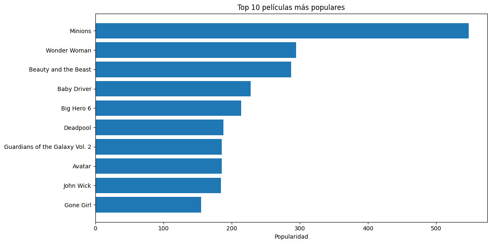
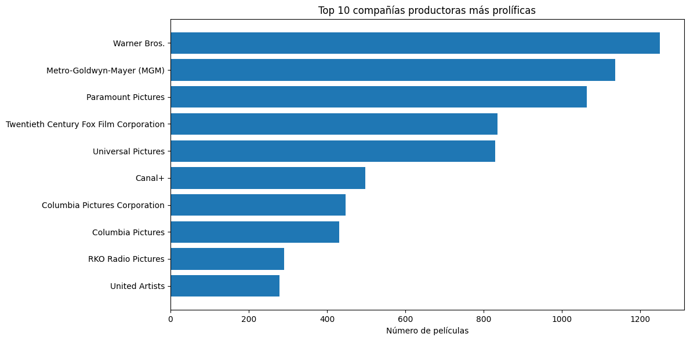
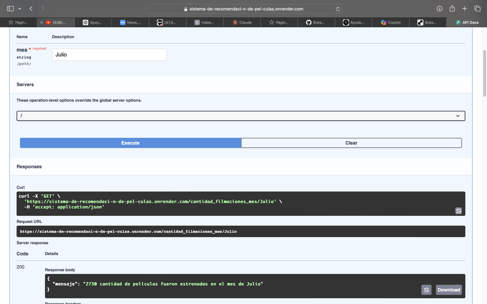
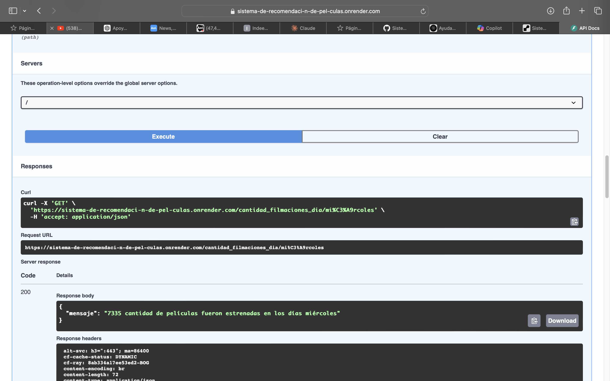
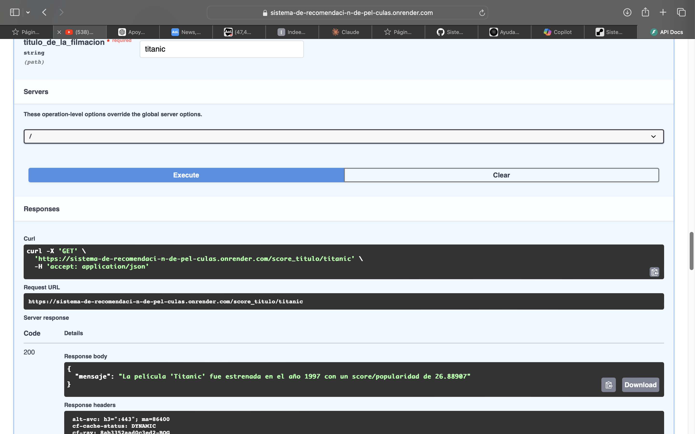
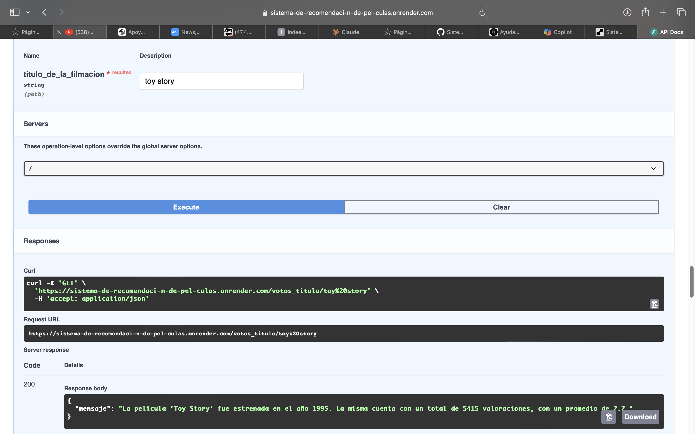
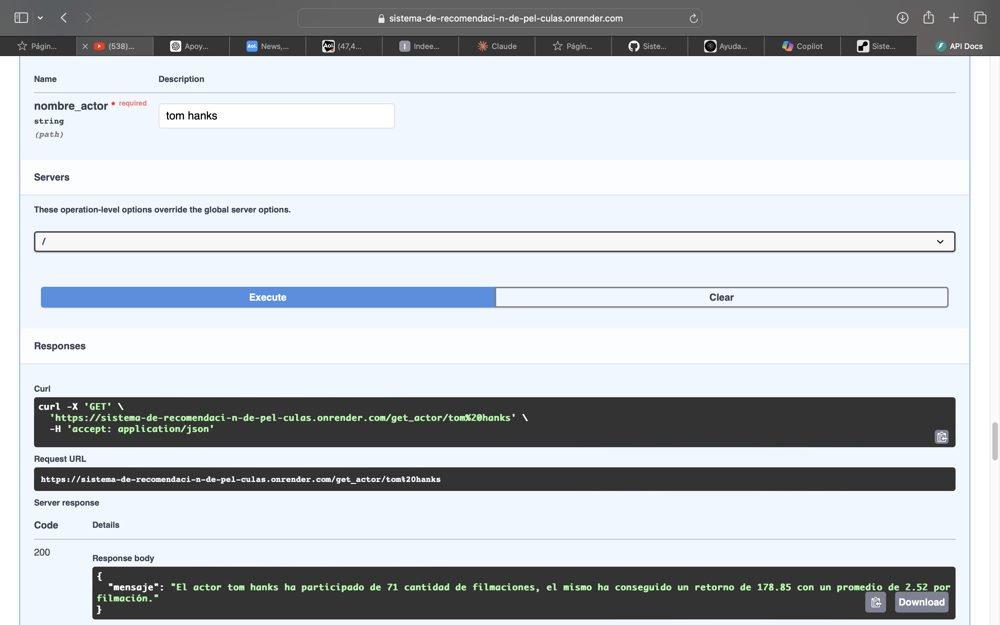
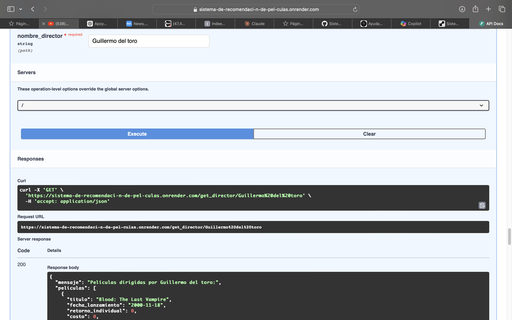

# Proyecto de Sistema de Recomendación para Plataforma de Streaming

## Proyecto individual Soy Henry PT09 Felipe Amezquita
**Julio 2024**

### ARCHIVOS Y LINKS DE INTERES

**Link de la implementacion en Render**: [LINK API IMPLEMENTACION RENDER](https://sistema-de-recomendaci-n-de-pel-culas.onrender.com) **puede demorar hasta 50 segundos en cargar por la implementacion de render gratuito, si hay necesidad, recarga la pagina despues de eso. 


Puedes Ver Archivo [Jupyter Notebook principal](https://github.com/psm545/Sistema-de-Recomendacion-de-Peliculas-Proyecto-Individual-Soy-Henry-PT09-DS-Feljpe-Amezquita/blob/main/Ejercicio%20Individual%201%20Felipe%20Amezquita%20DTP09.ipynb) en el repositorio de como fue el desarrollo total de todo el ejercicio.

Link **Video** explicativo: 


### Introducción

En este proyecto desarrollaremos un sistema de recomendación para una startup que provee servicios de agregación de plataformas de streaming. El objetivo es crear un modelo de machine learning que recomiende películas basándose en la similitud con otras películas. Este sistema de recomendación se implementará utilizando técnicas de procesamiento de lenguaje natural (NLP) y aprendizaje automático (ML) y se desplegará a través de una API construida con FastAPI e inplementada en Render.

### Objetivos

1. **Carga y Exploración de Datos**: Cargar los datos y realizar una exploración inicial para entender la estructura y calidad de los datos disponibles.
2. **Transformación de Datos**: Realizar las transformaciones necesarias en los datos, como desanidar campos anidados, manejar valores nulos, y crear nuevas características útiles para el modelo.
3. **Análisis Exploratorio de Datos (EDA)**: Identificar patrones, outliers y relaciones entre las variables que puedan ser útiles para el sistema de recomendación.
4. **Desarrollo del Sistema de Recomendación**: Implementar un sistema de recomendación basado en contenido utilizando técnicas como TF-IDF y similitud de coseno para calcular recomendaciones similares.
5. **Despliegue de la API con FastAPI**: Crear una API utilizando FastAPI para que el sistema de recomendación sea accesible a través de consultas específicas.
6. **Demostración y Validación**: Realizar una demostración del sistema de recomendación funcionando a través de la API, validando su funcionalidad con consultas de ejemplo.

### Resumen del Proyecto

Este proyecto aborda el desarrollo de un sistema de recomendación para una plataforma de streaming. El proceso incluye la carga y transformación de datos, análisis exploratorio, desarrollo del modelo de recomendación, y despliegue de una API para acceder al sistema. Las transformaciones de datos incluyen desanidar campos, manejar valores nulos, y crear nuevas columnas. El sistema de recomendación se basa en técnicas de NLP y ML, y se despliega utilizando FastAPI.

### Desarrollo

#### 1. Transformaciones (ETL)
Puedes ver el [Jupyter Notebook especifico del ETL](https://github.com/psm545/Sistema-de-Recomendacion-de-Peliculas-Proyecto-Individual-Soy-Henry-PT09-DS-Feljpe-Amezquita/blob/main/jpynb/1.%20TRANSFORMACIONES%20(ETL).ipynb) en el repositorio.

El proceso de Extracción, Transformación y Carga (ETL) es fundamental en el campo de la ciencia de datos y la analítica. En este proyecto hemos realizado un exhaustivo proceso ETL sobre un conjunto de datos relacionados con películas. El objetivo principal fue preparar los datos para su posterior análisis y uso en una API, mejorando su calidad, estructura y utilidad.

##### Objetivos del ETL

1. Integrar múltiples fuentes de datos en un único conjunto coherente.
2. Limpiar y estructurar los datos para facilitar su análisis.
3. Desanidar datos complejos para mejorar su accesibilidad.
4. Crear nuevas variables derivadas para enriquecer el análisis.
5. Optimizar el formato y tipo de datos para mejorar el rendimiento.

##### Paso a paso del proceso ETL
1. **Carga de datos**:
    - Importación de dos conjuntos de datos principales: `credits.csv` y `movies_dataset.csv`.
2. **Desanidación de datos**:
    - Desanidación de columnas complejas como `belongs_to_collection`, `genres`, `production_companies`, `production_countries`, `spoken_languages`, `cast` y `crew`.
3. **Limpieza de datos**:
    - Eliminación de columnas innecesarias: `video`, `imdb_id`, `adult`, `original_title`, `poster_path`, `homepage`.
    - Manejo de valores nulos: Los valores nulos en `revenue` y `budget` se rellenan con 0. Los valores nulos en `release_date` se eliminan.
4. **Creación de nuevas variables**:
    - Generación de la columna `return` basada en `revenue` y `budget` (`return = revenue / budget`). Si no hay datos disponibles, el valor es 0.
    - Extracción de año y mes de la fecha de lanzamiento para crear la columna `release_year`.
5. **Estandarización de formatos**:
    - Conversión de fechas al formato `yyyy-mm-dd`.

#### 2. Análisis Exploratorio de Datos (EDA)

Puedes ver el [Jupiter Notebook especifico del EDA](https://github.com/psm545/Sistema-de-Recomendacion-de-Peliculas-Proyecto-Individual-Soy-Henry-PT09-DS-Feljpe-Amezquita/blob/main/jpynb/EDA.ipynb) en el repositorio.

El Análisis Exploratorio de Datos (EDA) es una fase crucial en cualquier proyecto de ciencia de datos. En esta etapa, se estudia el dataset para comprender mejor sus características y relaciones entre las variables.

##### Objetivos del EDA
1. Identificar patrones y tendencias en los datos.
2. Detectar valores atípicos (outliers) y anomalías.
3. Comprender las relaciones entre las variables.
4. Evaluar la distribución de los datos y su calidad.

##### Paso a paso del EDA
1. **Análisis Descriptivo**:
    - Resumen estadístico de las variables numéricas y categóricas.
    - Distribución de las variables principales como `revenue`, `budget`, y `release_year`.
2. **Visualización de Datos**:
    - Histogramas y diagramas de caja (box plots) para identificar la distribución y outliers.
    - Gráficos de dispersión (scatter plots) para analizar relaciones entre variables.
    - Mapas de calor (heatmaps) para visualizar correlaciones entre variables.
3. **Detección de Outliers**:
    - Identificación de valores atípicos en variables clave como `revenue` y `budget`.
4. **Análisis de Correlación**:
    - Cálculo de la matriz de correlación para identificar relaciones significativas entre variables.
5. **Análisis de Variables Categóricas**:
    - Frecuencia de géneros (`genres`), compañías de producción (`production_companies`), y países de producción (`production_countries`).

Ejemplos:
### Mapas de calor



Podemos ver como es la realcion de los datos entre los generos de las peliculas



Este mapa de calor es interesante por que nos muestra como el Genero del Drama es el dominte del dataset, al ver la cantidad de peliculas que hay con su calificacion promedio. 



El top 10 de las peliculas mas populares




Si quieres ver el total del EDA miralo en el siguiente repositorio:  [Jupiter Notebook especifico del EDA](https://github.com/psm545/Sistema-de-Recomendacion-de-Peliculas-Proyecto-Individual-Soy-Henry-PT09-DS-Feljpe-Amezquita/blob/main/jpynb/EDA.ipynb)

#### 3. Escalamiento de Base de Datos o Dataset

Por la capacidad de procesamiento de Render en la version Gratuita, habia una posibilidad de tener que escalar el dataset. la primera opcion era hacer un escalamento aleatorio con Random, despues de hacer el analisis EDA pudimos ver ciertas variables que nos permitieron hacer una escalamiento de la base de datos aleatorio priorizando ciertas caracteristicas, como su puntuacion, popularidad, actores, compañia productoras entre otros.

Veras en el dataset la primera funcion que era para hacer un randon, y la segunda que lo hacia pero teniendo en cuenta las caracteristicas para tener un dataset de mejor calidad.


Mira el Jupiter Notebook especifico del escalamiento del dataset: [Jupiter Notebook especifico del escalamiento de datos](https://github.com/psm545/Sistema-de-Recomendacion-de-Peliculas-Proyecto-Individual-Soy-Henry-PT09-DS-Feljpe-Amezquita/blob/main/jpynb/Reescalamiento%20de%20la%20Base%20de%20datos.ipynb)


#### 4. Desarrollo del Sistema de Recomendación

**Link de la implementacion en Render**: [LINK API IMPLEMENTACION RENDER](https://sistema-de-recomendaci-n-de-pel-culas.onrender.com) **puede demorar hasta 50 segundos en cargar por la implementacion de render gratuito, si hay necesidad recarga la pagina despues de eso. 

Mira el Jupiter Notebook especifico de las funciones: [Jupiter Notebook especifico de las funciones](https://github.com/psm545/Sistema-de-Recomendacion-de-Peliculas-Proyecto-Individual-Soy-Henry-PT09-DS-Feljpe-Amezquita/blob/main/jpynb/Desarrollo%20API.ipynb)

Mira el Jupiter Notebook especifico del ML sistema de recomendacion de peliculas: [Jupiter Notebook especifico de ML sistema de recomendacion de peliculas](https://github.com/psm545/Sistema-de-Recomendacion-de-Peliculas-Proyecto-Individual-Soy-Henry-PT09-DS-Feljpe-Amezquita/blob/main/jpynb/ML%20SISTEMA%20DE%20RECOMENDACION%20DE%20PELICULAS.ipynb)

El sistema de recomendación se basa en técnicas de procesamiento de lenguaje natural y aprendizaje automático. Utilizamos TF-IDF y similitud de coseno para calcular la similitud entre películas y generar recomendaciones.


##### Paso a paso del desarrollo del sistema de recomendación
1. **Vectorización de texto**:
    - Utilización de TF-IDF para vectorizar descripciones de películas.
2. **Cálculo de similitud**:
    - Cálculo de la similitud de coseno entre las películas para generar recomendaciones basadas en contenido.
3. **Evaluación del modelo**:
    - Validación del modelo utilizando métricas de precisión y recall.

#### 4. Despliegue de la API con FastAPI
Proponemos disponibilizar los datos de la empresa usando el framework FastAPI. Las consultas que proponemos son las siguientes:


##### Endpoints de la API
1. **cantidad_filmaciones_mes(Mes)**: Devuelve la cantidad de películas estrenadas en el mes consultado.
    ```python
   def cantidad_filmaciones_mes(mes: str):
    # Convertir el mes a título para asegurar la coincidencia con la columna
    mes_normalizado = mes.capitalize()
    
    # Filtrar por el mes proporcionado
    peliculas_mes = data[data['month_name_es'] == mes_normalizado]
    cantidad = peliculas_mes.shape[0]
    
    return f"{cantidad} cantidad de películas fueron estrenadas en el mes de {mes_normalizado}"

     ```



2. **cantidad_filmaciones_dia(Dia)**: Devuelve la cantidad de películas estrenadas en el día consultado.
    ```python
      def cantidad_filmaciones_dia(dia: str):
    # Normalizar la entrada del usuario
    dia_normalizado = unidecode(dia).lower()  # Convertir a minúsculas y eliminar acentos
    #print(f"Dia ingresado normalizado: {dia_normalizado}")  # Verificar normalización
    
    # Filtrar por el día proporcionado
    peliculas_dia = data[data['day_of_week_es'] == dia_normalizado]
    cantidad = peliculas_dia.shape[0]
    
    if cantidad == 0:
        return f"No se encontraron películas estrenadas en los días {dia}"
    
    return f"{cantidad} cantidad de películas fueron estrenadas en los días {dia}"


    ```
    
   

4. **score_titulo(titulo_de_la_filmación)**: Devuelve el título, año de estreno y score de la filmación.
    ```python
    def score_titulo(titulo_de_la_filmacion: str):
    # Normalizar la entrada del usuario
    titulo_normalizado = unidecode(titulo_de_la_filmacion.lower())  # Convertir a minúsculas y eliminar acentos
    
    # Buscar la película en el DataFrame
    pelicula = data[data['title_normalized'] == titulo_normalizado]
    
    if pelicula.empty:
        return f"No se encontró la película con el título '{titulo_de_la_filmacion}'"
    
    # Extraer información
    titulo = pelicula['title'].values[0]
    ano_estreno = int(pelicula['release_year'].values[0])
    score = pelicula['popularity'].values[0]
    
    return f"La película '{titulo}' fue estrenada en el año {ano_estreno} con un score/popularidad de {score}"


    ```

   

5. **votos_titulo(titulo_de_la_filmación)**: Devuelve el título, cantidad de votos y promedio de votaciones de la filmación.
    ```python
   def votos_titulo(titulo_de_la_filmacion: str):
    # Normalizar la entrada del usuario
    titulo_normalizado = unidecode(titulo_de_la_filmacion.lower())  # Convertir a minúsculas y eliminar acentos
    
    # Buscar la película en el DataFrame
    pelicula = data[data['title_normalized'] == titulo_normalizado]
    
    if pelicula.empty:
        return f"No se encontró la película con el título '{titulo_de_la_filmacion}'"
    
    # Extraer información
    titulo = pelicula['title'].values[0]
    ano_estreno = int(pelicula['release_year'].values[0])  # Convertir el año a entero
    total_votos = int(pelicula['vote_count'].values[0])  # Convertir el total de votos a entero
    promedio_votos = pelicula['vote_average'].values[0]
    
    if total_votos < 2000:
        return f"La película '{titulo}' no cumple con el requisito de al menos 2000 valoraciones."
    
    return f"La película '{titulo}' fue estrenada en el año {ano_estreno}. La misma cuenta con un total de {total_votos} valoraciones, con un promedio de {promedio_votos}."


    ```
    

6. **get_actor(nombre_actor)**: Devuelve el éxito del actor medido a través del retorno, cantidad de películas y promedio de retorno.
    ```python
   def get_actor(nombre_actor: str):
    # Normalizar el nombre del actor ingresado
    nombre_actor_normalized = unidecode(nombre_actor.lower())
    
    # Filtrar las filas donde el actor esté en la lista de actores normalizados
    peliculas_actor = data[data['cast_names_normalized'].apply(lambda actors: nombre_actor_normalized in actors)]
    
    if peliculas_actor.empty:
        return f"No se encontró información para el actor '{nombre_actor}'"
    
    # Calcular la cantidad de películas, retorno total y promedio de retorno
    cantidad_peliculas = peliculas_actor.shape[0]
    retorno_total = peliculas_actor['return'].sum()
    promedio_retorno = retorno_total / cantidad_peliculas
    
    return f"El actor {nombre_actor} ha participado de {cantidad_peliculas} cantidad de filmaciones, el mismo ha conseguido un retorno de {retorno_total:.2f} con un promedio de {promedio_retorno:.2f} por filmación."


    ```
   

7. **get_director(nombre_director)**: Devuelve el éxito del director medido a través del retorno, nombre de cada película, fecha de lanzamiento, retorno individual, costo y ganancia.
    ```python
   def get_director(nombre_director: str):
    # Normalizar el nombre del director ingresado
    nombre_director_normalized = unidecode(nombre_director.lower())
    
    # Filtrar los registros donde el nombre coincida y es director
    director_records = data[(data['Crew_name_normalized'] == nombre_director_normalized) & (data['Crew_job'].str.contains('director', case=False))]
    
    if director_records.empty:
        # Si no es director, buscar por el nombre y devolver la información correspondiente
        not_director_records = data[(data['Crew_name_normalized'] == nombre_director_normalized)]
        if not_director_records.empty:
            crew_job = not_director_records['Crew_job'].values[0] if not_director_records['Crew_job'].notna().any() else 'desconocido'
            return f"No es director, el {nombre_director} es {crew_job}."
        else:
            return f"No se encontró información para {nombre_director}"
    
    # Extraer la información requerida para cada película del director
    peliculas_director = director_records[['title', 'release_date', 'revenue', 'budget']]
    peliculas_director['ganancia'] = peliculas_director['revenue'] - peliculas_director['budget']
    
    # Convertir la columna de fecha a formato string
    peliculas_director['release_date'] = peliculas_director['release_date'].dt.strftime('%Y-%m-%d')
    
    # Formatear el retorno
    peliculas_info = []
    for _, row in peliculas_director.iterrows():
        info = (f"Película: {row['title']}, Fecha de lanzamiento: {row['release_date']}, "
                f"Retorno individual: {row['revenue']:.0f}, Costo: {row['budget']:.0f}, "
                f"Ganancia: {row['ganancia']:.0f}")
        peliculas_info.append(info)
    
    peliculas_list = "\n".join(peliculas_info)
    return f"Director: {nombre_director}\n\n{peliculas_list}"


    ```
 

### Modelo de ML para recomendacion de peliculas

El sistema de recomendación de películas está diseñado para sugerir películas similares a una película dada por el usuario. Utiliza un enfoque combinado de similitud de coseno y cercanía de vecinos basado en características específicas. A continuación se detalla cómo funciona el sistema:

```python
    recomendar_peliculas_coseno(data, n_recomendaciones=5):
    required_columns = ['title', 'genres_names', 'company_names', 'vote_average']
    for col in required_columns:
        if col not in data.columns:
            raise ValueError(f"La columna '{col}' no está presente en el DataFrame.")
    
    data['vote_average'] = pd.to_numeric(data['vote_average'], errors='coerce')
    data['title_normalized'] = data['title'].apply(normalizar_texto)
    data['combined_features'] = data.apply(combinar_features, axis=1)
    
    if data['combined_features'].str.strip().str.len().sum() == 0:
        data['combined_features'] = data['title_normalized']
    
    tfidf = TfidfVectorizer(stop_words='english', min_df=1, max_df=0.9)
    tfidf_matrix = tfidf.fit_transform(data['combined_features'])
    
    if tfidf_matrix.shape[1] == 0:
        print("No se pudieron extraer características significativas de los datos.")
        return []
    
    cosine_sim = cosine_similarity(tfidf_matrix, tfidf_matrix)
    titulo = input("¿Sobre qué película quieres que te dé recomendaciones usando similitud del coseno? ")
    titulo_normalizado = normalizar_texto(titulo)
    
    idx = data.index[data['title_normalized'] == titulo_normalizado].tolist()
    if not idx:
        print(f"La película '{titulo}' no se encuentra en la base de datos.")
        return []
    idx = idx[0]
    
    sim_scores = list(enumerate(cosine_sim[idx]))
    sim_scores = sorted(sim_scores, key=lambda x: x[1], reverse=True)
    sim_scores = sim_scores[1:n_recomendaciones+1]
    
    movie_indices = [i[0] for i in sim_scores]
    recomendaciones = data[['title', 'vote_average']].iloc[movie_indices]


   
```
   

Mira el Jupiter Notebook especifico del ML sistema de recomendacion de peliculas: [Jupiter Notebook especifico de ML sistema de recomendacion de peliculas](https://github.com/psm545/Sistema-de-Recomendacion-de-Peliculas-Proyecto-Individual-Soy-Henry-PT09-DS-Feljpe-Amezquita/blob/main/jpynb/ML%20SISTEMA%20DE%20RECOMENDACION%20DE%20PELICULAS.ipynb)

# Documentacion:

Link dataset original [data set original](https://drive.google.com/drive/folders/1X_LdCoGTHJDbD28_dJTxaD4fVuQC9Wt5)

**Link de la implementacion en Render**: [LINK API IMPLEMENTACION RENDER](https://sistema-de-recomendaci-n-de-pel-culas.onrender.com) **puede demorar hasta 50 segundos en cargar por la implementacion de render gratuito, si hay necesidad recarga la pagina despues de eso. 

## Video

Link Video explicativo: 

## Jupiter Notebooks:

Puedes Ver Archivo [Jupyter Notebook principal](https://github.com/psm545/Sistema-de-Recomendacion-de-Peliculas-Proyecto-Individual-Soy-Henry-PT09-DS-Feljpe-Amezquita/blob/main/Ejercicio%20Individual%201%20Felipe%20Amezquita%20DTP09.ipynb) en el repositorio de como fue el desarrollo total de todo el ejercicio.

Puedes ver el [Jupyter Notebook especifico del ETL](https://github.com/psm545/Sistema-de-Recomendacion-de-Peliculas-Proyecto-Individual-Soy-Henry-PT09-DS-Feljpe-Amezquita/blob/main/jpynb/1.%20TRANSFORMACIONES%20(ETL).ipynb) en el repositorio.

Puedes ver el [Jupiter Notebook especifico del EDA](https://github.com/psm545/Sistema-de-Recomendacion-de-Peliculas-Proyecto-Individual-Soy-Henry-PT09-DS-Feljpe-Amezquita/blob/main/jpynb/EDA.ipynb) en el repositorio.

Mira el Jupiter Notebook especifico del escalamiento del dataset: [Jupiter Notebook especifico del escalamiento de datos](https://github.com/psm545/Sistema-de-Recomendacion-de-Peliculas-Proyecto-Individual-Soy-Henry-PT09-DS-Feljpe-Amezquita/blob/main/jpynb/Reescalamiento%20de%20la%20Base%20de%20datos.ipynb)

Mira el Jupiter Notebook especifico de las funciones: [Jupiter Notebook especifico de las funciones](https://github.com/psm545/Sistema-de-Recomendacion-de-Peliculas-Proyecto-Individual-Soy-Henry-PT09-DS-Feljpe-Amezquita/blob/main/jpynb/Desarrollo%20API.ipynb)

Mira el Jupiter Notebook especifico del ML sistema de recomendacion de peliculas: [Jupiter Notebook especifico de ML sistema de recomendacion de peliculas](https://github.com/psm545/Sistema-de-Recomendacion-de-Peliculas-Proyecto-Individual-Soy-Henry-PT09-DS-Feljpe-Amezquita/blob/main/jpynb/ML%20SISTEMA%20DE%20RECOMENDACION%20DE%20PELICULAS.ipynb)

---

 # Licence

Este proyecto fue desarrollado por Felipe Amezquita, Julio 2024, Desarrollo del primer proyecto individual para Soy Henry DSPT-09 
¡Gracias por tu interés en este proyecto! Si tienes alguna pregunta o sugerencia, no dudes en abrir un issue o contactarme.
